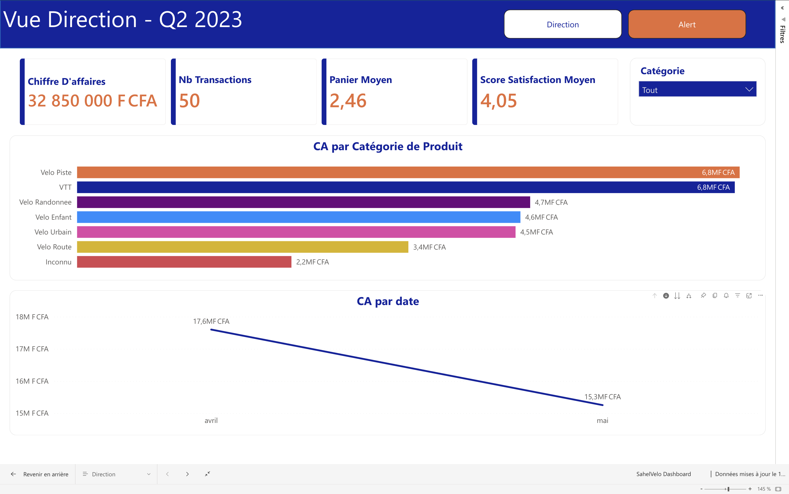

# 📊 Power BI — Analyse Ventes, Stocks & Satisfaction Client
### Distribution de vélos & accessoires | Afrique de l'Ouest

[](https://powerbi.microsoft.com)
[](https://www.microsoft.com/excel)
[](https://dax.guide)
[](LICENSE)

> Projet BI complet illustrant la mise en place d'un système de pilotage de la performance commerciale : de la collecte des données brutes jusqu'au dashboard décisionnel — en passant par la modélisation, les KPIs et les alertes dynamiques.

---

## 🎬 Démonstration complète

[](https://youtu.be/VAYAVpYkcMg)

▶️ **[Voir la démo complète (54 min)](https://youtu.be/VAYAVpYkcMg)**

---

## 🧩 Problématique métier

Une entreprise de distribution de vélos et accessoires opérant en Afrique de l'Ouest souhaitait **centraliser le pilotage de son activité** autour de 3 axes :

- **Ventes** — Quelle est la performance commerciale par produit, période et client ?
- **Stocks** — Quels produits sont en rupture ou en sur-stock ?
- **Satisfaction client** — Comment évolue la note moyenne et quels signaux faibles détecter ?

L'objectif : passer de fichiers Excel épars à **un outil de décision unique, actualisable et lisible par le management**.

---

## 📊 Aperçu du Dashboard

| Vue principale | Alertes Stock |
|:-:|:-:|:-:|
|  |  |

---

## ⚙️ Stack technique

| Outil | Rôle |
|---|---|
| **Power BI Desktop** | Rapport, visualisations, navigation multi-pages |
| **Power Query (M)** | Nettoyage, transformation, consolidation des sources |
| **DAX** | Mesures calculées, KPIs, intelligence temporelle |
| **Modélisation en étoile** | Optimisation des relations entre tables |

---

## 📐 Modèle de données

```
     [Inventaire]        [Avis-Clients]
          │                    │
          └────────────────────┘
                    │
              [Ventes]  ← Table de faits
                    │
              [Calendrier]  (table date DAX)
```

---

## 📁 Contenu du repository

```
├── SahelVelo Dashboard.pbix       # Fichier Power BI complet
├── SahelVelo Dashboard.pdf        # Export PDF du rapport
├── Ventes.csv                     # Transactions commerciales
├── Inventaire.csv                 # Catalogue produits & stocks
├── Avis-Clients.csv               # Évaluations satisfaction client
├── Direction.png                  # Capture page principale
├── Alerte Stock.png              # Capture page gestion stock
└── Script_VeloSahel_Final.html    # Script annoté du projet
```

---

## 📏 Mesures DAX implémentées

- **CA Total**, **CA MTD**, **CA YTD** — Chiffre d'affaires avec intelligence temporelle
- **Quantité vendue** — Volume global et par catégorie
- **Note moyenne satisfaction** — Pondérée par volume de transactions
- **Taux de rupture de stock** — % produits sous seuil d'alerte
- **Classement produits** — `RANKX` dynamique par CA et par marge
- **Alertes conditionnelles** — Indicateurs visuels basés sur des seuils métier

---

## 🚀 Utiliser ce projet

```bash
git clone https://github.com/bouba02/PowerBI-Analyse-Ventes-Stocks-Satisfaction.git
```

Ouvrir `SahelVelo Dashboard.pbix` avec Power BI Desktop.  
Si les sources ne se chargent pas : `Accueil → Transformer les données → Paramètres de la source de données` → rediriger vers les CSV du dossier cloné.

---

## 🤝 Collaboration & Missions

Ce projet illustre mon approche sur des missions de type :

- **Audit & structuration de données** — nettoyage, modélisation, gouvernance
- **Création de dashboards décisionnels** — à partir de vos fichiers Excel, ERP ou bases de données
- **Conseil BI** — choix d'outils, architecture data, accompagnement des équipes métier
- **Reporting automatisé** — Power BI Service, actualisation planifiée, partage sécurisé

Vous avez un projet data ou souhaitez mettre en place un système de pilotage ?  
**Contactez-moi :**

- 📺 [YouTube @BoubacarDataAnalyst](https://www.youtube.com/@BoubacarDataAnalyst)
- 💼 [LinkedIn](https://www.linkedin.com/in/boubacar-nikiema)
- 💻 [GitHub @bouba02](https://github.com/bouba02)
- 📧 nikiemaboubacar@gmail.com

---

*Projet réalisé par **Boubacar Nikiema** — Data Analyst & Consultant BI | Ngroup Media & Digital*
