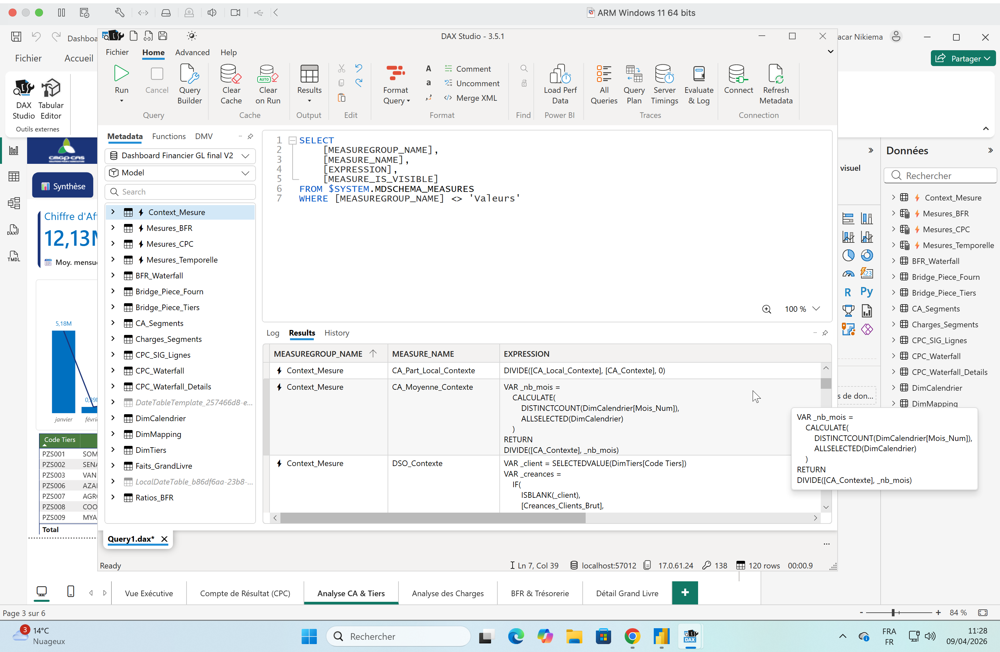

# 🚲 VéloSahel – Dashboard Power BI | Module 1 Formation BI

> **Projet pédagogique complet** — Analyse des ventes, des stocks et de la satisfaction client d'une entreprise de distribution de vélos en Afrique de l'Ouest, réalisé dans le cadre du **Module 1 de la formation Analyste BI avec Power BI**.

---

## 🎬 Vidéo complète sur YouTube

[](https://youtu.be/VAYAVpYkcMg)

▶️ **[Regarder la vidéo complète (54 min)](https://youtu.be/VAYAVpYkcMg)**

**Au programme :**
- Nettoyage et préparation des données (Power Query)
- Modélisation en étoile (Star Schema)
- Création de mesures DAX (KPIs, ratios, classements)
- Visualisations avancées et mise en page professionnelle
- Alertes dynamiques et navigation entre pages

---

## 📊 Aperçu du Dashboard

| Page Principale | Alerte Stock | Analyse Direction |
|:-:|:-:|:-:|
|  |  |  |

---

## 🗂️ Structure du Projet

```
VeloSahel-PowerBI/
│
├── 📊 SahelVelo Dashboard.pbix       # Fichier Power BI (rapport complet)
├── 📄 SahelVelo Dashboard.pdf        # Export PDF du dashboard
│
├── 📁 Données Sources
│   ├── Ventes.csv                    # Table de faits — transactions de vente
│   ├── Inventaire.csv                # Table de dimension — produits & stocks
│   └── Avis-Clients.csv              # Table de faits — satisfaction client
│
├── 🖼️ Captures
│   ├── Direction.png                 # Vue dashboard principal
│   ├── ALERTE.png                    # Page alertes de performance
│   └── Alerte Stock$.png             # Page gestion des stocks
│
└── 📝 Script_VeloSahel_Final.html    # Script commenté de la formation
```

---

## 📁 Description des Jeux de Données

### `Ventes.csv` — Transactions commerciales
| Colonne | Description |
|---|---|
| `IDTransaction` | Identifiant unique de la vente |
| `IDProduit` | Référence du produit vendu |
| `IDClient` | Référence du client |
| `Quantite` | Nombre d'unités vendues |
| `MontantVente` | Chiffre d'affaires généré (FCFA) |
| `DateTransaction` | Date de la transaction |

> ⚠️ **Données intentionnellement imparfaites** : doublons, valeurs manquantes et formats incohérents inclus pour pratiquer le nettoyage Power Query.

### `Inventaire.csv` — Catalogue produits
Informations sur les vélos et accessoires : référence, catégorie, prix unitaire, stock disponible, seuil d'alerte.

### `Avis-Clients.csv` — Satisfaction client
Évaluations clients par transaction : note de satisfaction (1–5), commentaires, canal de vente.

---

## 🛠️ Technologies Utilisées

| Outil | Usage |
|---|---|
| **Power BI Desktop** | Rapport, visualisations, navigation |
| **Power Query (M)** | Nettoyage, transformation, fusion des tables |
| **DAX** | Mesures calculées, KPIs dynamiques, intelligence temporelle |
| **Modélisation en étoile** | Structure relationnelle optimisée |
| **Mise en page Power BI** | Design professionnel, alertes visuelles |

---

## 📐 Modèle de Données (Star Schema)

```
        [Inventaire]          [Avis-Clients]
             │                      │
             └──────────────────────┘
                        │
                   [Ventes] ← Table de faits centrale
                        │
                   [Calendrier] (table date générée en DAX)
```

---

## 🎯 KPIs & Mesures DAX Clés

- **CA Total** — Chiffre d'affaires consolidé
- **Quantité Vendue** — Volume total d'unités
- **Note Moyenne Satisfaction** — Moyenne pondérée des avis clients
- **Taux de Rupture de Stock** — % produits sous seuil d'alerte
- **CA MTD / YTD** — Cumuls mois en cours / année en cours (intelligence temporelle)
- **Classement Produits** — RANKX dynamique par CA
- **Alertes Dynamiques** — Indicateurs visuels conditionnels

---

## 🚀 Comment Utiliser ce Projet

1. **Cloner le repository**
   ```bash
   git clone https://github.com/bouba02/VeloSahel-PowerBI.git
   ```

2. **Ouvrir le fichier Power BI**
   ```
   Double-cliquer sur : SahelVelo Dashboard.pbix
   ```

3. **Si les données ne se chargent pas**, aller dans :
   ```
   Accueil → Transformer les données → Paramètres de la source de données
   ```
   Et rediriger vers les fichiers CSV du dossier cloné.

4. **Explorer le dashboard** — 3 pages : Vue Générale, Alertes Stock, Analyse Direction

---

## 📚 Contexte Pédagogique

Ce projet est le **cas métier fil rouge** du **Module 1 — Formation Analyste BI avec Power BI**, conçu et dispensé par **Boubacar Nikiema (Ngroup Media & Digital)**.

**VéloSahel** est une entreprise fictive de distribution de vélos et accessoires en Afrique de l'Ouest. Le cas métier est conçu pour couvrir l'ensemble du workflow BI :

> Données brutes → Nettoyage → Modélisation → Analyse → Visualisation → Décision

Ce programme de 6 sessions (12h) a été conçu pour des professionnels souhaitant maîtriser Power BI dans un **contexte africain** — données en FCFA, noms de villes et produits adaptés au marché local.

---

## 👨‍💻 Auteur

**Boubacar Nikiema**  
Data Analyst | Formateur BI | Fondateur Ngroup Media & Digital

- 🌐 [LinkedIn](https://www.linkedin.com/in/boubacar-nikiema)
- 📺 [YouTube @BoubacarDataAnalyst](https://www.youtube.com/@BoubacarDataAnalyst)
- 💻 [GitHub @bouba02](https://github.com/bouba02)
- 📧 nikiemaboubacar@gmail.com

---

## ⭐ Si ce projet vous a aidé

Laissez une ⭐ sur ce repository et abonnez-vous à la chaîne YouTube pour ne pas manquer les prochains modules !

---

*Projet réalisé avec ❤️ pour la communauté data francophone d'Afrique*
